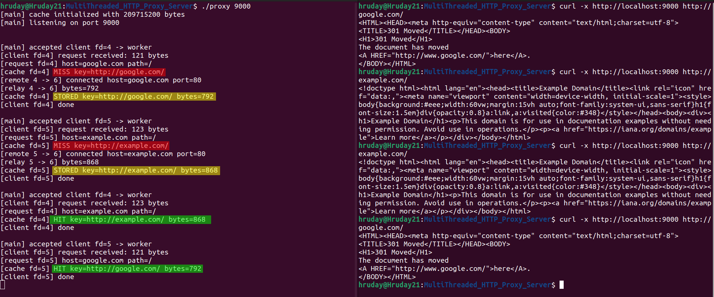

# Multi-Threaded HTTP Proxy Server

This project is an HTTP proxy that sits between a client and the internet, forwards HTTP requests, and caches responses.

## How to Use

The project currently uses three manual compile commands; no `Makefile` is included yet.

```bash
gcc -Wall -Wextra -pthread \
    -c main.c client_handler.c http_parser.c remote_fetch.c

g++ -std=c++17 -Wall -Wextra -pthread \
    -c cache.cpp

g++ main.o client_handler.o http_parser.o remote_fetch.o cache.o \
    -pthread -o proxy
```

Run the proxy:

```bash
./proxy 9000
```

Test a plain HTTP request through the proxy:

```bash
curl -x http://localhost:9000 http://example.com/
```

Run the same request again to exercise the cache hit path:

```bash
curl -x http://localhost:9000 http://example.com/
```

The same proxy address can be entered in a browser's HTTP proxy settings. HTTPS browser traffic is not supported yet because browsers use `CONNECT` to establish an encrypted tunnel.



## What This Project Does

A proxy sits between a client and a destination server: it receives the client's HTTP request, fetches the destination response, and relays that response back. Unlike a VPN, it does not transparently carry all network traffic or provide an encrypted tunnel. The cache is useful here because identical HTTP responses can be served locally without another DNS lookup, remote connection, or origin fetch.

Unlike a browser cache, which only serves the browser that originally made the request, a proxy cache is shared across every client behind the proxy. One client's fetched response can therefore be reused by other clients.

## How It Works

1. A client connects to the proxy and sends an HTTP request.
2. The proxy reads and parses the request, then checks the cache.
3. On a cache hit, the response is served immediately from memory.
4. On a cache miss, the proxy connects to the destination server, fetches the response, stores it in the cache, and relays it to the client.

## Architecture

- `main.c` owns the listening socket, `accept()` loop, thread creation, and process-level setup.
- `client_handler.c` owns one client's lifecycle and uses a semaphore to cap active client handlers at `MAX_CONCURRENT_CLIENTS = 10`.
- `http_parser.c` parses only the currently supported request shape: `GET http://host/path HTTP/1.1`.
- `remote_fetch.c` resolves the host, connects to port 80, sends an origin-form request, and relays the response.
- `cache.cpp` owns the C++ LRU implementation. `cache.h` exposes a plain C ABI to the C modules.

The cache has two important upgrades over a naive design:

1. `unordered_map<string, node*>` provides O(1) lookup, while the doubly linked list provides O(1) promotion and eviction. `get`, `put`, and eviction do not scan the cache linearly.
2. `pthread_rwlock_t` is initialized with `PTHREAD_RWLOCK_PREFER_WRITER_NONRECURSIVE_NP`. Cache lookup copies response bytes under a read lock, then performs LRU promotion under a short write lock. This allows concurrent reads while preventing writers from being starved by a continuous reader load.

## Benchmark Results

Here, a **miss** is a response fetched fresh from the origin server, while a **hit** is a response served from memory without an origin fetch.

The benchmark protocol was:

- 100 HTTP URLs
- 3 passes
- Each URL/pass: 1 miss followed by 10 immediate hits
- 5-second curl timeout
- Failed misses caused their dependent hit trials to be recorded as skipped

With `MAX_CONCURRENT_CLIENTS = 10`:

| Measurement | Misses | Hits |
|---|---:|---:|
| Successful trials | 292 | 2,920 |
| Failures | 8 | 0 |
| Skipped trials | 0 | 80 |
| Median | 168.061 ms | 0.484 ms |
| Mean | 280.943 ms | 12.654 ms |

The median successful miss-to-hit improvement was approximately **347×**. The hit mean is higher than its median because a few requests waited behind slow remote work; the median better represents the normal cache-hit path.

The reproducible benchmark files are in [`benchmarks/`](benchmarks/):

```bash
python3 benchmarks/benchmark_proxy.py \
    --urls benchmarks/benchmark_urls.txt \
    --proxy http://127.0.0.1:9000 \
    --passes 3 \
    --hits 10 \
    --timeout 5 \
    --output benchmarks/results/benchmark_results.csv

python3 benchmarks/analyze_benchmark.py \
    benchmarks/results/benchmark_results.csv
```

The short summary from the captured max-10 run is available in [`benchmarks/results/benchmark_summary_max10.txt`](benchmarks/results/benchmark_summary_max10.txt). The CSV is generated locally by the benchmark command and is intentionally ignored.

The rwlock-focused cache test can be run independently:

```bash
g++ -std=c++17 -Wall -Wextra -pthread \
    cache.cpp tests/cache_rwlock_test.cpp \
    -o cache_rwlock_test

./cache_rwlock_test
```
